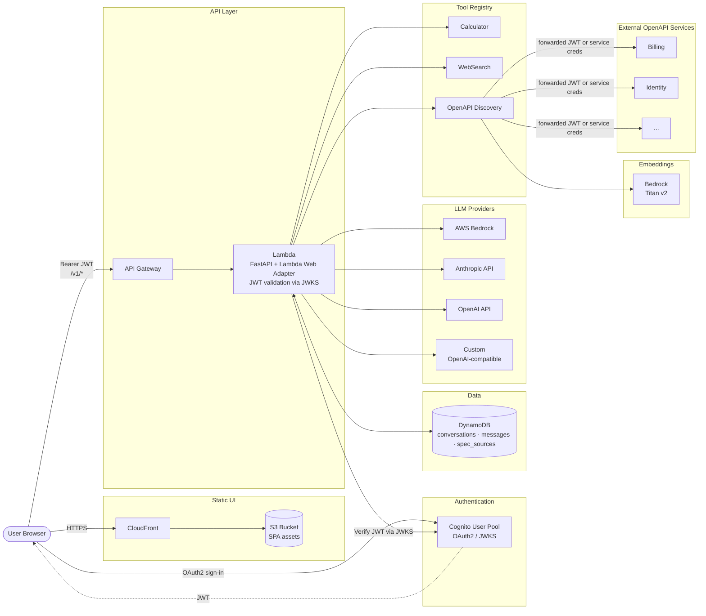

# Chat Agent API

A nearly production-ready AI agent chat API with per-user conversation memory, multi-LLM support, OAuth2/JWT authentication, custom tool integration, and full OpenAPI documentation.

## Architecture



**Request flow.** The browser loads the SPA from S3 via CloudFront, signs in against Cognito to receive a JWT, then calls `/v1/*` on API Gateway with the token. API Gateway forwards the request to Lambda, where the FastAPI app validates the JWT directly against Cognito's JWKS endpoint and verifies the expected claims — see [app/auth/jwt.py](app/auth/jwt.py). The FastAPI app runs in Lambda behind the AWS Lambda Web Adapter, persists conversations and messages to DynamoDB, fans out to the selected LLM provider, and executes any returned tool calls in a loop (up to 10 iterations) before returning the assistant reply.

**OpenAPI tool discovery.** When `enabled_specs` is set on a conversation, the chat-agent injects a list of available API services into the system prompt and exposes the `openapi_discovery` tool. The model uses three actions on that tool: `list_specs` (what services exist), `list_operations` (semantic search via Bedrock Titan v2 embeddings against parsed spec operations cached in memory), and `call_operation` (invoke a specific endpoint). Auth is resolved per-spec — `passthrough_jwt` forwards the inbound Cognito JWT, while `bearer_env` / `api_key_env` / `basic_env` use credentials from environment variables for service-to-service calls. See [docs/openapi-discovery-plan.md](docs/openapi-discovery-plan.md) for the full design and operator guide.

## Project Structure

```
chat-agent/
├── app/
│   ├── main.py              # FastAPI app, CORS, rate limiting, lifespan, includes AWS Lambda support
│   ├── config.py            # Pydantic settings from .env
│   ├── dynamodb.py          # helper function for accessing DynamoDB table resources
│   ├── models/db.py         # Conversation, Message, SpecSource models
│   ├── auth/jwt.py          # OAuth2 JWKS validation for AWS Cognito
│   ├── llm/                 # Pluggable providers: Anthropic, OpenAI, Bedrock, and Custom
│   ├── tools/               # Tool registry + Calculator + WebSearch + OpenAPI Discovery
│   ├── openapi/             # OpenAPI spec fetcher, parser, embedder, auth resolvers, registry
│   ├── routers/             # One router per resource group (incl. /spec-sources admin)
│   └── middleware/          # SlowAPI rate limiter keyed by user sub
├── scripts/
│   └── create_tables.py     # a Lambda function for generating the DynamoDB schema
├── tests/                   # 83 async tests (in-memory DynamoDB via moto, mocked LLM and embeddings)
├── docs/                    # Design docs (e.g. openapi-discovery-plan.md)
├── deploy.sh                # a shell script for building the app and distributing it to an AWS Lambda
├── Dockerfile
├── docker-compose.yml       # app + dynamodb (for running locally)
├── dynamoDB.md              
├── migrate.py               # AWS Lambda function to migrate RDS database
├── pyproject.toml           # main project dependencies for `uv` package manager
└── run.sh                   # a shell script for running the Lambda using uvicorn with the AWS Lambda Web Adapter layer
```

## 1. Install & Run Locally

```bash
cd chat-agent
cp .env.example .env          # fill in your API keys
uv venv && uv pip install -e ".[test]"
# or: python3 -m venv .venv && .venv/bin/pip install -e ".[test]"
uvicorn app.main:app --reload
```

> **Dev auth shortcut**: leave `OAUTH2_JWKS_URL` empty in `.env` — the server accepts any JWT without verifying the signature. Generate a test token at [jwt.io](https://jwt.io) with `{"sub": "user1"}` as the payload.

## 2. Apply Database Migrations

```bash
alembic upgrade head
```

To auto-generate a new migration after changing models:

```bash
alembic revision --autogenerate -m "describe change"
alembic upgrade head
```

## 3. Run the Test Suite

```bash
pytest tests/ -v
```

Tests use an in-memory SQLite database and mock all LLM provider calls — no API keys required.

## 4. Swagger UI

- **Swagger UI**: [http://localhost:8000/docs](http://localhost:8000/docs)
- **ReDoc**: [http://localhost:8000/redoc](http://localhost:8000/redoc)

## 5. curl Examples

```bash
# Set a test token (dev mode: any JWT with a sub claim, no signature verification)
TOKEN="eyJhbGciOiJIUzI1NiJ9.eyJzdWIiOiJ1c2VyMSJ9.ignored"

# Health check (no auth required)
curl http://localhost:8000/v1/health

# List available models
curl -H "Authorization: Bearer $TOKEN" http://localhost:8000/v1/models

# Create a conversation
curl -s -X POST http://localhost:8000/v1/conversations \
  -H "Authorization: Bearer $TOKEN" \
  -H "Content-Type: application/json" \
  -d '{"title":"My Chat","system_prompt":"You are a helpful assistant."}' | jq

# List conversations (paginated)
curl -H "Authorization: Bearer $TOKEN" \
  "http://localhost:8000/v1/conversations?page=1&page_size=10"

# Get conversation config
CONV_ID="<id from create response>"
curl -H "Authorization: Bearer $TOKEN" \
  http://localhost:8000/v1/conversations/$CONV_ID/config

# Update conversation config (switch model, enable tools)
curl -s -X PATCH http://localhost:8000/v1/conversations/$CONV_ID/config \
  -H "Authorization: Bearer $TOKEN" \
  -H "Content-Type: application/json" \
  -d '{"model":"gpt-4o","provider":"openai","enabled_tools":["calculator"]}'

# Register an OpenAPI spec source (admin)
curl -s -X POST http://localhost:8000/v1/spec-sources \
  -H "Authorization: Bearer $TOKEN" \
  -H "Content-Type: application/json" \
  -d '{
    "id": "billing",
    "url": "https://billing.internal/openapi.json",
    "description": "Invoices, refunds, subscriptions, payment methods.",
    "auth": {"type": "passthrough_jwt"}
  }'

# List registered spec sources
curl -H "Authorization: Bearer $TOKEN" http://localhost:8000/v1/spec-sources

# Enable openapi_discovery + specs on a conversation
curl -s -X PATCH http://localhost:8000/v1/conversations/$CONV_ID/config \
  -H "Authorization: Bearer $TOKEN" \
  -H "Content-Type: application/json" \
  -d '{"enabled_tools":["openapi_discovery"],"enabled_specs":["billing"]}'

# Send a message (blocking)
curl -s -X POST http://localhost:8000/v1/conversations/$CONV_ID/messages \
  -H "Authorization: Bearer $TOKEN" \
  -H "Content-Type: application/json" \
  -d '{"content":"What is 42 * 7?"}' | jq

# Send a message (SSE streaming)
curl -N -X POST "http://localhost:8000/v1/conversations/$CONV_ID/messages?stream=true" \
  -H "Authorization: Bearer $TOKEN" \
  -H "Content-Type: application/json" \
  -d '{"content":"Tell me a short story."}'

# List message history (cursor-based pagination)
curl -H "Authorization: Bearer $TOKEN" \
  "http://localhost:8000/v1/conversations/$CONV_ID/messages?limit=50"

# Paginate backwards from a message ID
curl -H "Authorization: Bearer $TOKEN" \
  "http://localhost:8000/v1/conversations/$CONV_ID/messages?limit=50&before=<message_id>"

# Clear all messages (keeps the conversation)
curl -X DELETE -H "Authorization: Bearer $TOKEN" \
  http://localhost:8000/v1/conversations/$CONV_ID/messages

# Delete a conversation (and all its messages)
curl -X DELETE -H "Authorization: Bearer $TOKEN" \
  http://localhost:8000/v1/conversations/$CONV_ID
```

## 6. Docker Compose

```bash
cp .env.example .env   # set ANTHROPIC_API_KEY and/or OPENAI_API_KEY
docker compose up --build
```

The app starts on [http://localhost:8000](http://localhost:8000). Migrations run automatically on startup. PostgreSQL data is persisted in a named volume (`pgdata`).

To stop and remove volumes:

```bash
docker compose down -v
```

## Configuration

All config is via environment variables (or a `.env` file). Copy `.env.example` to get started:

| Variable | Description | Default |
|---|---|---|
| `DATABASE_URL` | SQLAlchemy async DB URL | `sqlite+aiosqlite:///./chat_agent.db` |
| `OAUTH2_JWKS_URL` | JWKS endpoint for JWT verification (empty = dev mode) | `""` |
| `OAUTH2_AUDIENCE` | Expected JWT audience claim | `""` |
| `DEFAULT_LLM_PROVIDER` | Default provider (`anthropic`, `openai`, `custom`) | `anthropic` |
| `DEFAULT_MODEL` | Default model ID | `claude-sonnet-4-6` |
| `ANTHROPIC_API_KEY` | Anthropic API key | `""` |
| `OPENAI_API_KEY` | OpenAI API key | `""` |
| `CUSTOM_LLM_BASE_URL` | Base URL for OpenAI-compatible custom endpoint | `""` |
| `RATE_LIMIT_RPM` | Max message requests per user per minute | `60` |
| `MAX_HISTORY_MESSAGES` | Default context window message limit | `50` |
| `DEFAULT_SYSTEM_PROMPT` | Fallback system prompt for new conversations | `You are a helpful AI assistant.` |
| `CORS_ORIGINS` | Comma-separated allowed origins, or `*` | `*` |
| `DYNAMODB_TABLE_SPEC_SOURCES` | DynamoDB table for OpenAPI spec sources | `chat_spec_sources` |
| `BEDROCK_EMBEDDING_MODEL` | Bedrock model ID for operation embeddings | `amazon.titan-embed-text-v2:0` |
| `OPENAPI_SPEC_FETCH_TIMEOUT_SECONDS` | Timeout for fetching upstream OpenAPI specs | `15.0` |
| `OPENAPI_LIST_OPERATIONS_TOP_K` | Max operations returned by `list_operations` | `20` |
| `OPENAPI_AUTH_*` (per-spec env vars) | Service-to-service credentials referenced by `bearer_env`/`api_key_env`/`basic_env` auth configs (e.g. `BILLING_API_TOKEN`) | — |

## Design Notes

- **Tool loop**: when the LLM returns tool calls, they are executed and results fed back automatically, up to 10 iterations per request. Tool calls and results are persisted and replayed correctly on future turns.
- **Auth dev mode**: empty `OAUTH2_JWKS_URL` skips JWT signature verification — useful for local development without a Cognito or other JWKS provider.
- **Context truncation**: keeps the last `MAX_HISTORY_MESSAGES` messages per conversation (overridable per-conversation via the config endpoint).
- **Rate limiting**: keyed on the JWT `sub` claim when authenticated, falls back to client IP.
- **Streaming**: `?stream=true` on the send-message endpoint returns a Server-Sent Events stream of `{"content": "..."}` chunks, terminated by `data: [DONE]`.
- **OpenAPI tool discovery (retrieve-then-invoke)**: instead of registering every operation of every spec as a separate tool, the agent exposes a single `openapi_discovery` tool with three actions — `list_specs`, `list_operations`, `call_operation`. Operations are parsed once per spec, embedded with Bedrock Titan v2, and indexed in memory; `list_operations` does cosine-similarity search over those embeddings. This scales to many specs without blowing up the model's tool list. See [docs/openapi-discovery-plan.md](docs/openapi-discovery-plan.md) for design and operator guide.
- **Auth for downstream API calls**: per-spec auth config — `passthrough_jwt` (default for Cognito-protected internal services; forwards the inbound user JWT), `bearer_env` / `api_key_env` / `basic_env` (service-to-service via environment variables), `static` (non-secret headers), `none`. Tokens are never persisted or logged.
- **Per-conversation spec scoping**: `enabled_specs` on the conversation gates which specs the discovery tool can see. Spec descriptions are injected into the system prompt so the model knows what services exist without burning a `list_specs` call every turn.
